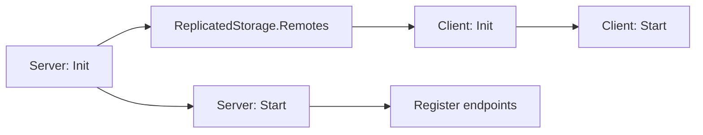

# Getting Started

Networker has separate server and client modules. The server creates the remote hierarchy; the client discovers it.



## Setup order

1. On the server, call `NetworkerServer:Init()` and then `NetworkerServer:Start()` once.
2. Register events, functions, and requests after the server has started.
3. On each client, call `NetworkerClient:Init()` and check its Boolean result.
4. Call `NetworkerClient:Start()` once before using client APIs.

`Init()` does not start listeners. `Start()` does not create the folders, so this order matters.

## Server settings

The server defaults are `ClientToServerFunction = false`, `FirstGlobalMiddleware = true`, `Logging = false`, and `PcallMiddlewares = true`. Read [Server Settings](server/Settings.md) before changing them—especially `PcallMiddlewares`, because its default does not enforce middleware `false` returns.

> [!NOTE]
> Client `Init()` waits up to approximately five seconds for each missing part of the remote hierarchy. It returns `false` if one is still unavailable.

## Minimal event

```lua
-- Server
Network:Init()
Network:Start()

Network:Register("SetReady", {}, function(_context, player, ready)
	if ready then
		print(player.Name .. " is ready")
	end
end)

-- Client
assert(Network:Init())
Network:Start()
Network:FireServer("SetReady", true)
```

## Remote hierarchy

Server `Init()` creates this structure if it is absent:

```text
ReplicatedStorage
└── Remotes
    ├── Events       -- registered RemoteEvents
    ├── Functions    -- registered RemoteFunctions
    └── Requests
        └── RequestEvent -- one shared RemoteEvent for every Request
```

> [!WARNING]
> Networker searches for children by name and does not verify their Roblox class. Do not place a non-remote instance at one of these required locations.
