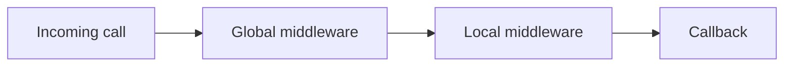

# Middleware

Middleware validates or prepares an incoming client-to-server call before its server callback runs. It applies to `Register`, `RegisterFunction`, and `RegisterRequest`.

## API

| Function | Purpose |
|---|---|
| [`Start`](middleware/Start.md) | Installs player-removal cleanup for rate-limit and cooldown state. |
| [`RateLimit`](middleware/RateLimit.md) | Allows at most a configured number of accepted calls per second per player. |
| [`Cooldown`](middleware/Cooldown.md) | Blocks a player for a configured number of seconds after an accepted call. |
| [`Resolve`](middleware/Resolve.md) | Stores callback-produced data in `context.Data`. |
| [`Types`](middleware/Types.md) | Checks runtime types for positional arguments. |
| [`Range`](middleware/Range.md) | Validates the first argument as a number in an inclusive range. |
| [`Custom`](middleware/Custom.md) | Adapts your own middleware function. |

## Middleware configuration

Pass either an array of middleware functions or an object with `Middlewares` and optional `Global` fields:

```lua
{
	Middlewares = {
		Network.Middleware:Types({ "number" }),
		Network.Middleware:Range(1, 100),
	},
	Global = {
		UseAll = true,
		Disable = { Audit = true },
	},
}
```

An empty `{}` is valid and means no endpoint middleware.

## Execution order

By default, global middleware runs first, followed by endpoint middleware in `ipairs` order, then the endpoint callback.



Set `Network.Settings.FirstGlobalMiddleware = false` to run endpoint middleware first instead. Its default is `true`. `Global.UseAll = false` skips every global middleware for that endpoint and runs only endpoint middleware. See [Server Settings](server/Settings.md) for all defaults.

## Global middleware

Define globals in `Network.GlobalMiddlewareDefinitions` before registering an endpoint:

```lua
Network.GlobalMiddlewareDefinitions.RequestLimit = {
	Factory = Network.Middleware.RateLimit,
	Args = { 10 },
}
```

At endpoint registration, Networker calls each factory with `Network.Middleware` as its first argument and the items in `Args`, and stores the returned middleware for that endpoint. Changes to definitions do not update already registered endpoints.

To disable a named global, use a keyed table: `Disable = { RequestLimit = true }`. If global definitions form a numeric array, `Disable` is searched by numeric index instead.

> [!WARNING]
> A list such as `Disable = { "RequestLimit" }` does not disable a string-named global in this implementation. Use `Disable = { RequestLimit = true }`.

## Return values and failures

Each middleware conventionally returns `true` to continue or `false` to reject. A second return value is used as a middleware name in diagnostics.

```lua
return true, "Permission"
-- or
return false, "Permission"
```

> [!WARNING]
> With `Network.Settings.PcallMiddlewares` enabled (the default), Networker catches thrown middleware errors, but does **not** inspect a successfully returned `false`. Therefore `RateLimit`, `Cooldown`, `Types`, `Range`, `Resolve`, and `Custom` do not stop the callback by return value under the default setting. Set `Network.Settings.PcallMiddlewares = false` before receiving calls to make a false first return value reject the pipeline. In that mode, middleware errors are not caught here.

> [!NOTE]
> Middleware has no post-callback phase. It only executes before the callback.
