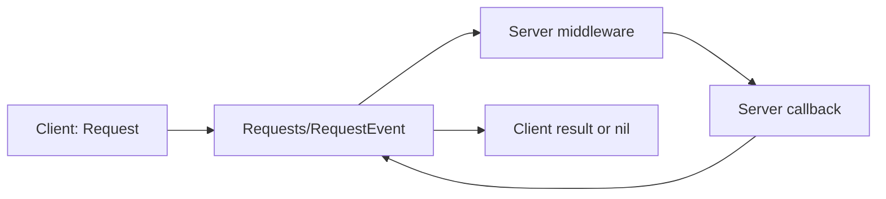

# Request System

A Request is Networker's client-to-server request/response protocol. It exists to give a client a synchronous-looking result with a configurable timeout, without making every endpoint a `RemoteFunction`.



## Choosing a transport

| Mechanism | Direction | Response | Networker behavior |
|---|---|---|---|
| `RemoteEvent` | Either direction | No built-in response | Use `Register` / `FireServer` / `FireClient` for one-way notifications and actions. |
| `RemoteFunction` | Either direction | Caller yields for result | Use `RegisterFunction` / `InvokeServer`; server-to-client invocation is separately gated. |
| `Request` | Client to server | Client waits for a reply | Uses one shared `RemoteEvent`, middleware, and a client-side timeout. |

## Why use Request?

Requests multiplex every registered request name through `ReplicatedStorage.Remotes.Requests.RequestEvent`; registering a Request does **not** create a RemoteEvent per name. Each client call receives an incrementing request ID, and the reply is matched to its pending request.

This makes Requests a strong fit for gameplay queries and commands that need a server answer, such as inventories, matchmaking, or daily rewards. Unlike a `RemoteFunction`, the client stops waiting after the configured timeout.

## Trade-offs

- Request is only client-to-server; it cannot replace server-to-client RPC.
- It returns `nil` for timeout, unknown request name, an enforced middleware rejection, and callback failure. The public return value does not distinguish these states.
- It is not asynchronous: `Request()` yields until the response or timeout.
- A server callback still runs normally; a client timing out does not cancel it.

## Timeout behavior

`Network:Request(name, counter, ...)` uses `counter` seconds, defaulting to `5`. A supplied `counter` less than or equal to zero is replaced with `5` and can log a warning. On timeout it returns `nil`.

When a registered callback errors, `RegisterRequest`'s `errorInfo` is sent back to the client, but the client logs it (when logging is enabled) and still returns `nil`. Only the callback's first return value is sent as a successful Request result.

> [!WARNING]
> Treat `nil` as an unsuccessful request, not as proof that the endpoint does not exist. Design successful endpoints so `nil` is not a meaningful successful payload.

## Example

```lua
-- Server
Network:RegisterRequest("GetSettings", "Settings are unavailable", {}, function(_context, player)
	return SettingsByUserId[player.UserId]
end)

-- Client
local settings = Network:Request("GetSettings", 3)
if not settings then
	return -- show a retry state
end
ApplySettings(settings)
```
